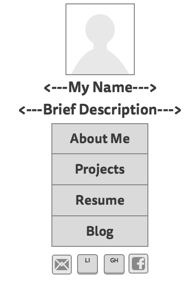

What is a wireframe?
A wireframe is a diagram (it can be drawn with pen and paper or created online using one of a multitude of wireframing tools) that displays the functional elements of a website. This layout is used to plan a site's structure and functionality.

What are the benefits of wireframing?
A wireframe is beneficial because it provides a visual layout of what a website might look like. Wireframes focus on the range of functions available on said website and connects the flow of information presented on the site with the site's surface/visual design.

Did you enjoy wireframing your site?
I really enjoyed wireframing my site. Personally, it made my site almost come alive. I am getting increasingly excited to learn how to incorporate CSS into the site to make it truly visually appealing.

Did you revise your wireframe or stick with your first idea?
I did in fact revise my wireframe. I initially had a layout that seemed a bit generic and pedestrian. Then, I thought to myself, "let me see if I can find some of the wireframe-indexes from past DBC students on GitHub." The examples I found were extremely helpful in exposing me to alternative ways to layout my website. 

What questions did you ask during this challenge? What resources did you find to help you answer them?
From the outset, I repeateedly asked myself how I want my website to look. Since it is a relatively basic, personal website with few complicated functions, I opted for a minimalist design so that the users attention is focused on my website's content ('About Me,' 'Projects,' 'Resume,' and 'Blog'). I found some great examples of website indexes by searching for the work of past DBC students. This opened my eyes to a number of concepts that I hadn't previously thought of. Another resource I used was Mockingbird, an online wireframing tool.

Which parts of the challenge did you enjoy and which parts did you find tedious?
I enjoyed nearly this entire challenge. It was great to wireframe my website and brainstorm ways that will optimize a user's experience when they visit my site.