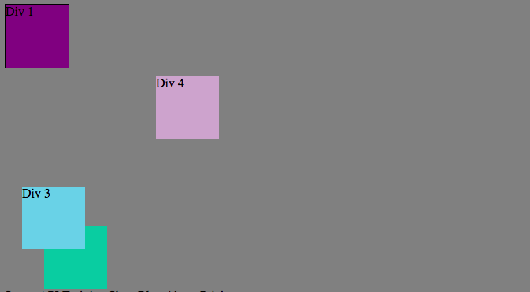
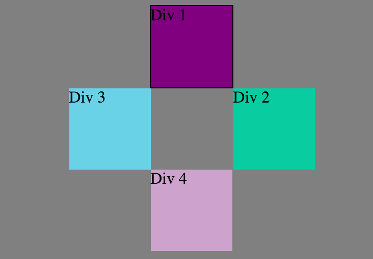

<h1>How can you use Chrome's DevTools inspector to help you format or position elements?</h1>

Chrome DevTools inspector is an extremely helpful tool to help format a webpage and position elements on the said webpage. Implementing CSS into an HTML file often requires alot of trial and error in order to achieve a desired style. That being said, Chrome DevTools allows a web designer (or anyone using Google Chrome for that matter) to test out certain modifications to a webpage's CSS without permanently changing the webpage's style. It is an amazing tool for experimenting with CSS. 

<h1>How can you resize elements on the DOM using CSS? </h1>
You can resize elements on the Document Object Model (DOM) using CSS by adjusting the element's dimensions (height and width). Additionally, you can resize a container of information (such as the structural HTML elementrs - header, footer, nav, section, etc.) by adjusting the margin, padding, and border.

<h1>What are the differences between absolute, fixed, static, and relative positioning? Which did you find easiest to use? Which was most difficult?</h1>

Absolute Positioning (position: absolute;) tells an element that it is positioned in relation to the first parent element it has that doesn’t have a default, static position (or in other words, that does have an absolute position).

Relative Positioning (position: relative;) tells an element to move relative to where it would have landed if it just had the default, static positioning. Thus, setting the top, right, bottom, and left properties of a relatively-positioned element will cause it to be adjusted away from its normal position. Other content will not be adjusted to fit into any gap left by the element.

Static Position (position: static;) is the default position of HTML elements. Elements with a static position are not affected by the top, bottom, left, and right properties, and are not positioned in any specific way, but rather according to the notmal flow of the page.

Fixed Positioning (position: fixed;) anchors an element to the browser window. Therefore, as you scroll up and down, the fixed element stays put even as other elements scroll past.

In my opinion, the easiest positioning values to use are static (default) and fixed. The other two, relative and absolute, are a bit more difficult because using them requires a better understanding of how changing the desired element's position will impact the rest of the webpage.

<h1>What are the differences between margin, border, and padding?</h1>

The margin is the space between the border of an element and the perimeter of the webpage. The border is what encompasses an element and separates it from the margin. The padding is the space between the content of an element and the border. These three components along with the content, combine to form what web designers call the CSS Box Model.

<h1>What was your impression of this challenge overall? (love, hate, and why?)</h1>

I enjoyed this challenge because it helped me significantly improve my understanding of HTML and CSS positioning. Alot of the challenge required trial and error, but aside from that, I feel more comfortable with positioning elements on a webpage after completing this assignment.