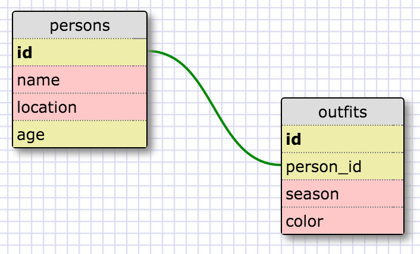
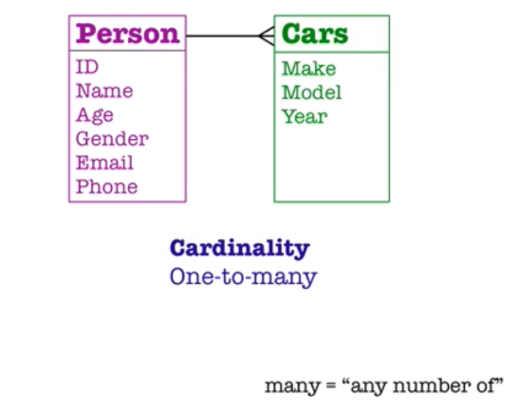

<h1>SQL Queries:</h1>
<ol>
	<li>
	Select all data for all states
	
Query:  SELECT * FROM states;

	</li>
	<li>
	Select all data for all regions
	
Query: SELECT * FROM regions;

	</li>
	<li>
	Select the state_name and population for all states
	
Query: SELECT state_name, population FROM states;

	</li>
	<li>
	Select the state_name and population for all states by population.The state with the highest population should be at the top.
	
Query: SELECT state_name, population
		   FROM states
		   ORDER BY population DESC;

	</li>
	<li>
	Select the state_name for the states in region 7
	
Query: SELECT state_name
		   FROM states
		   WHERE region_id = 7;

	</li>	   
	<li>
	Select the state_name and population_density for states with a population_density over 50 ordered from least to most dense.
	
Query: SELECT state_name, population_density
		   FROM states
		   WHERE population_density > 50 
		   ORDER BY population_density ASC;

	</li>
	<li>
	Select the state_name for states with a population between 1 million and 1.5 million people.
	
Query: SELECT state_name
		   FROM states
		   WHERE population > 1000000 
		   AND population < 1500000;

	</li>
	<li>
	Select the state_name and region_id for states ordered by region in ascending order.
	
Query: SELECT state_name, region_id
		   FROM states 
		   ORDER BY region_id ASC;

	</li>
	<li>
	Select the region_name for the regions with "Central" in the name
	
Query: SELECT region_name
		   FROM regions
		   WHERE region_name LIKE '%CENTRAL%';

	</li>
	<li>
	Select the region_name and the state_name for all states and regions in ascending order by region_id. Refer to the region by name. (This involves joining the tables).
	
Query: SELECT regions.region_name, states.state_name
		   FROM regions
		   JOIN states ON
		   regions.id = states.region_id
		   ORDER BY region_id ASC;

	</li>
</ol>

<h1>My Schema Design</h1>

<h1>Reflection</h1>
<h3>What are databases for?</h3>

A database is a way to store information so that it can easily be accessed, managed, and updated.

<h3>What is a one-to-many relationship?</h3>

A "one-to-many" relationship refers to the cardinality between two groups of information. The best way to understand it is through an example. Lets create a database comprised of two tables (i.e. - two separate entities), "person" and "cars" (see image below). A person's attributes include Name, Age, Gender, Email, Phone, and various others, while a car's attributes include make, model, and year. A person is said to own a car, which establishes a relationship between the two entities. A person can own many cars, which thus defines a one-to-many relationship. However, it is important to note that "many" means "any number of," which includes 0.

<h3>What is a primary key? What is a foreign key? How can you determine which is which?</h3>

A "PRIMARY KEY" is a unique identifier used to connect multiple tables within a database. The specified PRIMARY KEY is unique to each instance of an entity/table and makes sure that none of the values in the column are NULL and that each value in the column is unique (only appears once). Also, a table cannot have more than one PRMARY KEY column. A "foreign key" is a column that contains the primary key of another table in the database. We use foreign keys and primary keys to connect rows in two different tables. Foreign keys do not need to be unique and can be NULL. You can determine which is which based on the fact that each row within the designated "primary key" column conly appears once, while in the foreign key column of the other table, values can be repeated.

<h3>How can you select information out of a SQL database? What are some general guidelines for that?</h3>

One of the primary goals of SQL is to retrieve information stored in database. This is referred to as “querying.” The main SQL commands to filter the results of a query are:

<ul>
	<li>
		SELECT DISTINCT = specifies that the statement is going to be a query that returns unique values in the specified column(s).
	</li>
	<li>
	WHERE = a clause that indicates you want to filter the result set to include only rows where the following condition is true.
	</li>
	<li>
		Operators used w/ the WHERE clause: =, !=, >, <, >=, <= 
	</li>
	<li>
		LIKE = a special operator to see if a pattern exists in the database
	</li>
	<li>
		% = a wildcard character that matches zero or more missing letters in the pattern.
		<ul>
			<li>
				A% = matches all movies with names that begin with “A”
			</li>
			<li>
				%a = matches all movies that end with “a”
			</li>
			<li>
				%man% = matches all movies that contain the word “man” in its name
			</li>
		</ul>
	</li>
		BETWEEN = a special operator to filter the results within a certain range. The values can be numbers, text or dates.
	</li>
	<li>
		AND = a special operator that allows you to combine multiple conditions in a WHERE clause to make the result set more specific and useful (in other words, it allows to refine a query).
	</li>
	<li>
		OR = similar to AND in that it combines multiple conditions in a WHERE clause. As long as one of the conditions is true, the row is added to the result set.
	</li>
	<li>
		ORDER BY = a clause that indicates you want to sort the result set by a particular column either alphabetically or numerically.
	</li>
		<ul>
			<li>
				DESC = a keyword in SQL applied to the ORDER BY clause to sort the results in descending order (high-low or Z-A)
			</li>
			<li>
				ASC = sorts the results in ascending order (low-high or A-Z)
			</li>
		</ul>
	<li>
		LIMIT = a clause that lets you specify the maximum number of rows the result set will have. This is very useful when filtering a result data set.
	</li>
</ul>

Also note that all statments in SQL end with a semicolon.
