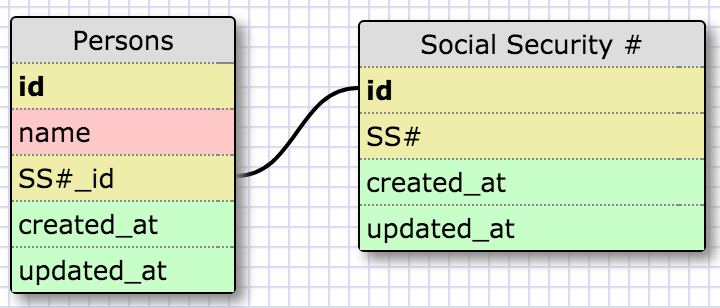
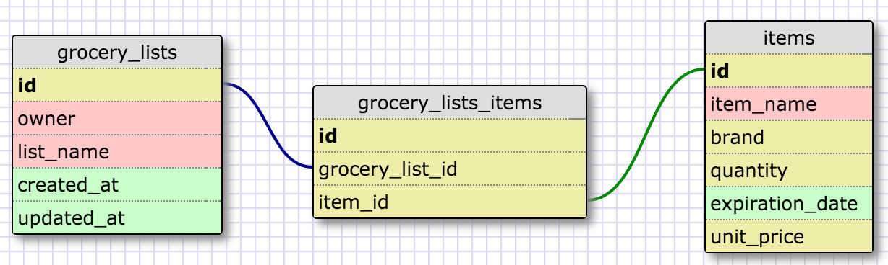

<h3>One-to-One Relationship</h3>

	In this schema, I've created a one-to-one relationship between two entities, "Persons" and "Social Security #." This is a one-to-one relationship because each person can only have one SS#, and each SS# is unique to a particular person.

<h3>Many-to-Many Relationship</h3>

	In this schema, I've created a many-to-many relationship between two entities, "grocery_lists" and "items." I've also created an intermediary or "join" table called "grocery_lists_items" to connect the two entities. A many-to-many relationship exists between grocery lists and items because each grocery list can contain many items, while many of the same items can appear on multiple grocery lists.

<h3>What is a one-to-one database?</h3>

	A one-to-one database is a relationship used when two things have a single relationship to one another. Essentially, they are a pair.

<h3>When would you use a one-to-one database? (Think generally, not in terms of the example you created).</h3>

*(See previous question)*

<h3>What is a many-to-many database?</h3>

 
	A many-to-many database is a relationship between two distinct entities (tables) that are connected by a “join” table. A join table connects the two independent tables by keeping track of the two ids (foreign keys). It is important to note that in such a relationship, an attribute in one entity can be assigned to only one attribute in the other entity. In other words, using the example above, an grocery item can appear no more than once per grocery list indicating this "unique" relationship.

<h3>When would you use a many-to-many database? (Think generally, not in terms of the example you created).</h3>

*(See previous question)*

<h3>What is confusing about database schemas? What makes sense?</h3>

	Although I feel like I have a solid grasp of how each database works on its own, I'm still a little bit confused when it comes to combining the three different database types (one-to-many, one-to-one, and many-to-many). I think this will come with time so I'm not too worried, but I will definitely try to find some examples of more complex databases to further solidify my understanding.

